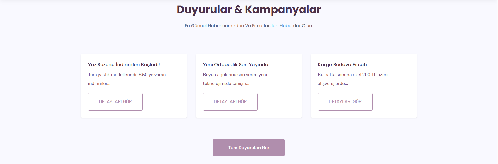
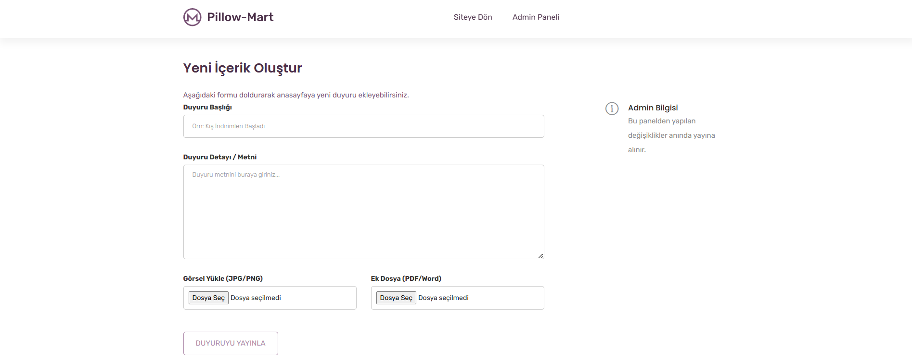
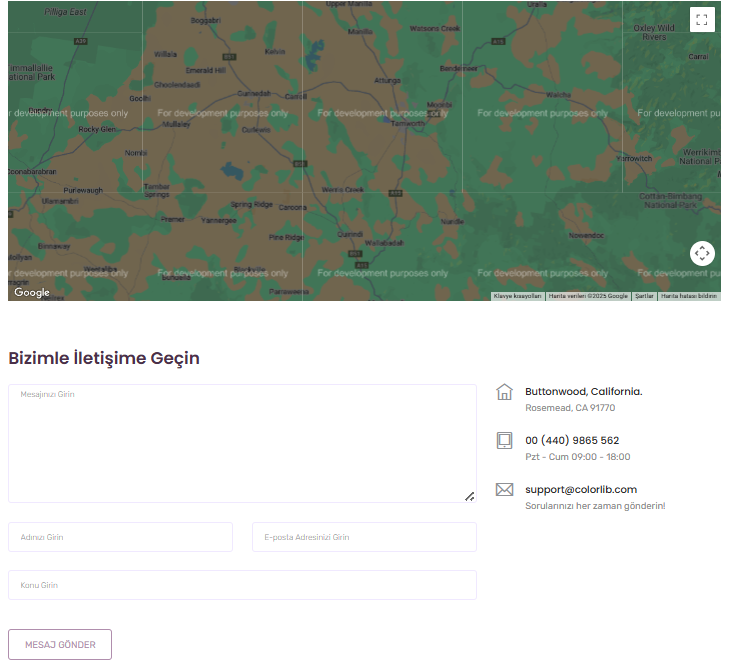
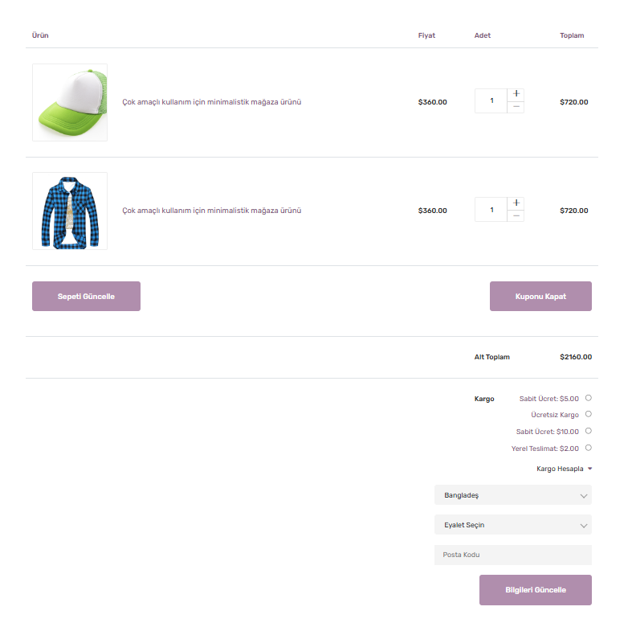

# 🛏️ PillowMart – Modern Yastık Satış Sitesi

PillowMart, modern bir tasarım yaklaşımı ile hazırlanmış, tamamen **HTML, CSS ve JavaScript** kullanılarak geliştirilmiş bir yastık satış sitesi demosudur.  
Bu proje, kullanıcı dostu arayüzü, responsive tasarımı ve sade animasyonlarıyla bir e-ticaret sitesinin temel görünümünü yansıtır.

---

## 🚀 Özellikler

- 📱 **Responsive (mobil uyumlu) tasarım**  
- 🎨 Modern ve temiz UI/UX yaklaşımı  
- 🧩 HTML + CSS + JavaScript ile tamamen frontend odaklı yapı  
- 🖼️ Slider, ürün kartları, kategori bölümleri  
- 🕹️ Basit etkileşimler ve animasyonlar  
- 🛒 E-ticaret tasarım mantığını gösteren demo yapı  
- 🔍 Temiz kod yapısı ve kolay geliştirilebilirlik

---

## 🛠️ Kullanılan Teknolojiler

- **HTML5**
- **CSS3**
- **JavaScript**
- Google Fonts  


---

## 📸 Ekran Görüntüleri

>
> 
> 
> 
> 
> 

---

## 📂 Proje Yapısı

```plaintext
PillowMart/
├── index.html
├── about.html
├── contact.html
├── css/
│   └── style.css
├── js/
│   └── main.js
└── img/
    └── ... (ürün ve tema görselleri)
